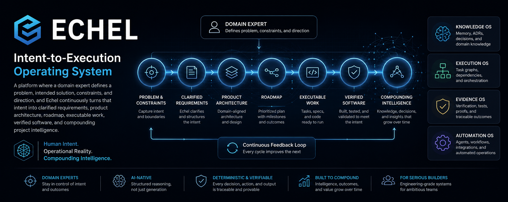

# Echel



## AI-Native Software Engineering OS

Echel is a practical methodology and local operating system for turning a raw product idea into an execution-ready software repository.

It exists because AI can produce code quickly, but successful products need more than output. They need durable product memory, traceable requirements, stable domain language, architecture decisions, agent-ready tasks, verification evidence, release readiness, operations knowledge, and a loop for learning after delivery.

Echel is not an AI coding assistant and it is not only a documentation framework. It is the control layer around AI-assisted software engineering: the system that preserves what the product means, decides when work is ready, gives agents bounded context, and proves progress with evidence.

## Product-To-Repository Factory

Echel takes a product from discovery to operation through one connected lifecycle:

```text
Raw idea
-> Product Discovery Specification
-> Product Canon
-> Product Strategy
-> Requirements
-> Domain Model
-> Architecture
-> Roadmap
-> Execution Tasks
-> Repository Baseline
-> Implementation
-> Validation
-> Deployment
-> Operations
-> Governance and Learning
```

Each stage has a durable place in the product wiki, a responsible AI role, source artifacts, acceptance criteria, and downstream handoff rules. Later work must refine earlier product truth instead of silently reinterpreting it.

## Why It Matters

Most AI-assisted development fails in the gaps between artifacts.

- Ideas are too vague, so requirements become unstable.
- Requirements are not traceable, so architecture drifts.
- Architecture is not tied to domain language, so code invents concepts.
- Tasks are too broad, so agents mix unrelated changes.
- Verification is informal, so done work lacks proof.
- Product memory is scattered, so every session starts over.

Echel closes those gaps by making the product lifecycle explicit, inspectable, and executable.

## Core Methodology

### Discovery

The Product Discovery Specification captures the founder or domain expert contract: problem, users, buyers, operators, current workflow, pain points, solution concept, business model, success criteria, scope, non-goals, constraints, assumptions, hypotheses, risks, open questions, and research needs.

Every important statement should carry a type, confidence, and traceability ID so AI agents do not treat assumptions as facts.

### Canon

Product Canon becomes the source of product truth after discovery. It records what the product is, what it is not, why it exists, who it serves, why customers would pay, product principles, and non-negotiables.

### Strategy

Strategy turns canon into market and business focus: ICP, buyer/user/operator model, wedge, competition, positioning, pricing, packaging, and PMF evidence.

### Requirements

Requirements convert strategy into testable scope. MVP, later work, out-of-scope items, acceptance criteria, dependencies, risks, and non-functional requirements are separated before implementation planning begins.

### Domain

Domain modeling defines the product language before architecture. Ubiquitous language, bounded contexts, entities, aggregates, events, workflows, policies, and business rules make sure everyone builds from the same business concepts.

### Architecture

Architecture maps domain and requirements into system shape, components, data, APIs, events, workflow, security, observability, deployment posture, and ADRs. Complexity must be justified.

### Roadmap And Execution

Roadmap artifacts define delivery phases and release plans. Execution phase artifacts become one-session, agent-executable task packets with objective, scope, files, dependencies, acceptance criteria, tests, rollback notes, documentation updates, and definition of done.

### Validation And Evidence

Validation artifacts map tests to requirement IDs, task IDs, domain concepts, and acceptance criteria. Evidence records capture proof with subject, kind, path, checksum, producer, and summary.

### Deployment And Operations

Deployment artifacts define environments, release process, rollback, secrets, and production checklist. Operations artifacts define runbook, observability, incident response, backup and recovery, SLO/SLA, change management, and evolution backlog.

### Governance And Learning

Governance artifacts define source-of-truth hierarchy, ADR process, traceability, quality gates, repository integrity, migration compatibility, and contradiction handling. The learning loop turns incidents, RCA, customer feedback, roadmap changes, and strategy changes into durable follow-up work.

## Operating Surfaces

Echel is built from several connected surfaces. They are distinct on purpose.

### Methodology

The methodology defines the lifecycle, stage gates, source-of-truth hierarchy, traceability rules, and AI-agent role boundaries. It answers: what must be true before the next stage can safely begin?

### Product Memory

Product memory lives in root `wiki/` in generated projects. It is committed with the product and contains discovery, canon, strategy, requirements, domain, architecture, roadmap, execution, validation, deployment, operations, governance, work, decisions, reports, agents, and engineering docs.

Echel Core lives separately under `echel-core/` and uses `WIKI_ROOT` to operate on the product wiki without owning it.

### Product Graph

The product graph connects lifecycle artifacts: discovery items, assumptions, hypotheses, buyers, stakeholders, strategy, requirements, domain concepts, bounded contexts, business rules, architecture components, tasks, tests, evidence, deployment artifacts, operations artifacts, contradictions, and learnings.

Graph nodes preserve statement type, confidence, source stage, verification status, and trace IDs where available.

### Cockpit

The cockpit is the product steering surface. It shows lifecycle stages from Discovery through Governance, blockers, next action, responsible AI role, artifacts, and safe command-backed actions.

### Agents

Echel models a virtual delivery team: Founder Interviewer, Business Analyst, Product Manager, Strategy Analyst, Domain Modeler, Solution Architect, Delivery Planner, Implementation Agent, QA Agent, Security Reviewer, Release Manager, Operations Steward, and Governance Auditor.

Each role has responsibilities, inputs, outputs, and forbidden actions. Handoffs preserve decisions, assumptions, risks, unresolved questions, evidence, stale artifacts, and next-stage instructions.

### Evidence

Evidence is the proof layer. Tasks, validation, release readiness, and proof packs should rely on registered evidence rather than conversational claims.

### Readiness

Readiness gates report whether a stage or release can proceed. They surface missing discovery, vague requirements, domain inconsistency, architecture gaps, release blockers, evidence gaps, risks, and governance issues.

## Generated Project Shape

New projects are initialized as product repositories:

```text
<project-name>/
  wiki/          product-owned memory committed with the project
  echel-core/    Echel methodology, schemas, prompts, tools, and automation
```

`wiki/` is part of the product. `echel-core/` is framework infrastructure and is ignored by the generated product repository.

## Start

```bash
make init-wizard
```

Non-interactive:

```bash
make init-project \
  NAME=my-product \
  MODE=scratch \
  DEST=. \
  PROBLEM="..." \
  SOLUTION="..." \
  DIRECTION="..." \
  USERS="..." \
  BUYERS="..." \
  OPERATORS="..." \
  MVP="..." \
  BUSINESS_MODEL="..." \
  NON_GOALS="..." \
  CONSTRAINTS="..." \
  RISKS="..." \
  STACK="..." \
  SUCCESS="..." \
  RESEARCH="..."
```

Then:

```bash
cd <project-name>/echel-core
make wiki-health
python3 tools/echel.py status
```

Verify the vNext generated-project contract:

```bash
make verify-vnext-generated
```

## Command Path

The lifecycle command path is:

```bash
python3 tools/echel.py discover
python3 tools/echel.py readiness --stage discovery
python3 tools/echel.py canon
python3 tools/echel.py strategy
python3 tools/echel.py requirements
python3 tools/echel.py readiness --stage requirements
python3 tools/echel.py domain
python3 tools/echel.py readiness --stage domain
python3 tools/echel.py architecture
python3 tools/echel.py readiness --stage architecture
python3 tools/echel.py execution-tasks
python3 tools/echel.py repository-factory
python3 tools/echel.py validate
python3 tools/echel.py evidence add --id EVID-VALIDATION-001 --subject TEST-001 --kind validation-report --path wiki/reports/validation-summary.md --producer "QA Agent" --summary "Validation proof"
python3 tools/echel.py readiness --stage release
python3 tools/echel.py learning
```

## Learn More

- [Technical Quick Start](docs/technical-quick-start.md)
- [Methodology Contract](docs/development/methodology.md)
- [Product Graph](docs/development/phase2-product-graph.md)
- [Agent Work Packets](docs/development/phase3-agent-work-packets.md)
- [Product Cockpit](docs/development/phase4-product-cockpit.md)
- [Readiness And Proof Packs](docs/development/phase5-readiness-and-proof-packs.md)
